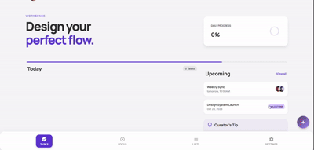

# ✅ Task Management & Focus Web App

> A comprehensive productivity web application built to help users manage tasks, track daily routines, organize custom lists, and stay focused using a built-in focus timer.

---

## 🔗 Quick Links
* **Live Demo:** [View Live Demo](https://to-do-list-5e865.web.app/Sign-In)
* **Status:** Finished / Live

---

## 🎥 Project Demo

---

## 🛠️ Tech Stack
* **Frontend:** Angular, Standalone Components, TypeScript
* **Styling & UI:** Bootstrap 5, Font Awesome, Custom CSS, Circular Progress Animations
* **Backend & Database:** Firebase (Authentication, Firestore Database, Hosting)
* **Audio & Features:** Sound Effects, Focus Timer, Custom Icons & Lists

---

## ✨ Key Features
* **Focus Mode & Timer:** A dedicated focus page featuring a built-in timer and task tracking to keep you concentrated.
* **Custom Lists & Icons:** Users can create personalized lists with custom icons for better categorization.
* **Task Categorization:** Organize tasks into different types like Routines, Strategic tasks, and more.
* **Circular Progress Tracker:** An animated circular progress indicator that calculates and visualizes your completion percentage dynamically.
* **User Profile & Data Sync:** Secure authentication allowing users to manage their profiles, upload personal pictures, and sync all data in real-time.
* **Sound Effects:** Audio cues and effects integrated into the focus and task completion flows.

---

## 💡 Technical Challenges & Solutions
1. **Challenge 1 (Focus Timer Bug & Double Ringing):**
   * *What happened:* The focus timer sometimes wouldn't ring or would ring twice because of async timing issues on the frontend.
   * *How I fixed it:* Handled the timer state logic directly through Firebase to track the exact countdown count, ensuring it only triggers the alarm once the countdown finishes reliably.
2. **Challenge 2 (Data Persistence & Refresh Loss):**
   * *What happened:* Tasks were disappearing whenever the page was refreshed.
   * *How I fixed it:* Integrated Firebase Firestore to save and fetch tasks dynamically, making sure user data persists safely across sessions.
3. **Challenge 3 (Cross-List Data Mixing):**
   * *What happened:* When clicking on any custom list, it was incorrectly showing tasks from *all* lists combined instead of filtering specific items.
   * *How I fixed it:* Separated the data services and logic for each list independently to ensure clean data isolation and correct routing per list.

---

